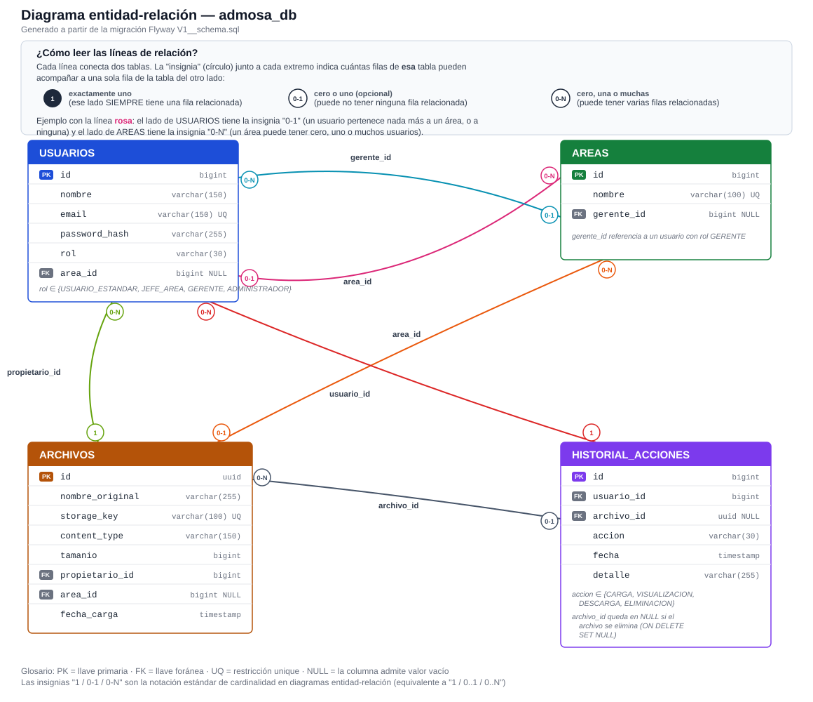

# Manual técnico — AdMosa

Plataforma de gestión segura de archivos por usuario, rol y área. Prueba técnica perfil Senior.

Repositorios:

- Backend: https://github.com/FranRod877/admosa-backend
- Frontend: https://github.com/FranRod877/admosa-frontend

## 1. Arquitectura general

Aplicación de dos capas independientes que se comunican por HTTP/JSON:

```
┌─────────────────────┐        HTTPS / REST (JSON)       ┌──────────────────────────┐
│   admosa-frontend    │  ───────────────────────────────▶ │      admosa-backend      │
│  React 19 + TS + Vite│ ◀─────────────────────────────── │ Spring Boot 4 + Java 17  │
└─────────────────────┘                                    └───────────┬──────────────┘
                                                                        │
                                                             ┌──────────▼──────────┐
                                                             │     PostgreSQL       │
                                                             │  (Flyway migrations) │
                                                             └──────────────────────┘
```

El backend expone una API REST protegida con JWT; el frontend es una SPA que consume esa API con `fetch` (sin librería de routing: el cambio de vista se resuelve por estado de React según el rol autenticado).

## 2. Stack tecnológico

| Capa | Tecnología |
|---|---|
| Backend | Java 17, Spring Boot 4 (Web, Data JPA, Security), Hibernate 7, Flyway, PostgreSQL, JJWT (JWT), Gradle |
| Frontend | React 19, TypeScript, Vite, CSS propio (sin librería de UI) |
| Base de datos | PostgreSQL 15+ |
| Autenticación | JWT stateless, contraseñas con BCrypt |

## 3. Modelo de datos

### 3.1 Diagrama entidad-relación



### 3.2 Tablas

- **usuarios**: cuenta de acceso. `rol` determina el nivel de acceso (`USUARIO_ESTANDAR`, `JEFE_AREA`, `GERENTE`, `ADMINISTRADOR`). `area_id` es la única área a la que pertenece (nulo para Gerente y Administrador).
- **areas**: catálogo de áreas de la organización. `gerente_id` referencia al usuario (con rol GERENTE) que la gestiona; un mismo gerente puede gestionar varias áreas.
- **archivos**: metadatos de cada archivo cargado. El contenido físico se guarda en disco (`admosa.storage.location`) con un nombre interno (`storage_key`) distinto al nombre original, para que la URL de descarga nunca exponga la ruta real del archivo. `area_id` es una copia del área del propietario al momento de la carga.
- **historial_acciones**: bitácora de auditoría. Se registra una fila por cada `CARGA`, `VISUALIZACION`, `DESCARGA` o `ELIMINACION`. Si el archivo referenciado se elimina, `archivo_id` queda en `NULL` (`ON DELETE SET NULL`) pero el registro persiste con el nombre del archivo en `detalle`.

Migraciones versionadas con Flyway en `admosa-backend/src/main/resources/db/migration/V1__schema.sql`.

## 4. Seguridad y control de acceso

### 4.1 Autenticación

- `POST /api/auth/login` valida credenciales contra `usuarios.password_hash` (BCrypt) y devuelve un JWT firmado (HMAC) con el id, correo y rol del usuario.
- Cada petición subsecuente envía `Authorization: Bearer <token>`. Un filtro (`JwtAuthenticationFilter`) valida el token y carga el `Usuario` autenticado en el contexto de seguridad — no hay sesión ni estado en el servidor (stateless).
- El secreto de firma (`admosa.jwt.secret`) y su expiración son configurables por variable de entorno; nunca se hardcodea un secreto real en el repositorio.

### 4.2 Autorización por rol y por dato

Los cuatro roles no solo habilitan/deshabilitan pantallas: la visibilidad de cada archivo depende de la relación entre el usuario y ese archivo específico (propietario, área, áreas gestionadas). Esta lógica se centraliza en `FileAccessPolicy` (no se repite en cada endpoint) y en el `switch` por rol de `FileService`/`HistoryService`:

| Rol | Ver / descargar | Eliminar | Historial |
|---|---|---|---|
| Usuario estándar | Solo archivos propios | Solo archivos propios | Sin acceso |
| Jefe de área | Propios + de su misma área | Solo archivos propios | Sin acceso |
| Gerente | Propios + de las áreas que gestiona | Propios + de las áreas que gestiona | Acciones de los usuarios de sus áreas |
| Administrador | Todos | Todos | Todas las acciones del sistema |

Reglas adicionales:
- Un usuario con rol **Gerente** o **Administrador** no pertenece a ningún área propia (`area_id = NULL`); el backend lo fuerza automáticamente al asignar o cambiar esos roles, incluso si se envía un `area_id` en la petición.
- Al retirarle el rol de Gerente a un usuario, el backend libera automáticamente las áreas que gestionaba (`areas.gerente_id` vuelve a `NULL`) para que no quede una referencia "huérfana".
- `GET /api/history` está protegido con `@PreAuthorize("hasAnyRole('GERENTE','ADMINISTRADOR')")`: un Jefe de área o Usuario estándar recibe `403` aunque intente llamarlo directamente.

### 4.3 Almacenamiento seguro de archivos

- Cada archivo se guarda en disco con un nombre generado (UUID), nunca con el nombre original ni una ruta predecible.
- Toda descarga/visualización pasa por `GET /api/files/{id}/download` o `/{id}/view`, usando el **id de base de datos** del archivo — el cliente nunca conoce ni puede adivinar la ruta física en el servidor.
- Extensión y tamaño se validan en el servidor antes de guardar (no solo en el cliente): extensiones permitidas `pdf, doc, docx, xls, xlsx, ppt, pptx, txt, csv, jpg, jpeg, png, gif, webp`, tamaño máximo 25MB. Un archivo rechazado nunca llega a tocar disco.

## 5. Endpoints REST

| Método | Ruta | Acceso | Descripción |
|---|---|---|---|
| POST | `/api/auth/login` | Público | Autenticación, devuelve JWT |
| POST | `/api/files` | Autenticado | Carga un archivo (multipart) |
| GET | `/api/files` | Autenticado | Lista archivos visibles según el rol |
| GET | `/api/files/{id}/download` | Autenticado + política | Descarga un archivo |
| GET | `/api/files/{id}/view` | Autenticado + política | Previsualiza un archivo (inline) |
| DELETE | `/api/files/{id}` | Autenticado + política | Elimina un archivo |
| GET | `/api/history` | Gerente, Administrador | Historial de acciones según alcance |
| GET | `/api/users` | Administrador | Lista de usuarios |
| PATCH | `/api/users/{id}` | Administrador | Cambia rol y/o área de un usuario |
| GET | `/api/areas` | Administrador | Lista de áreas |
| PATCH | `/api/areas/{id}` | Administrador | Asigna/quita el gerente de un área |

Manejo de errores centralizado (`GlobalExceptionHandler`): `400` (validación / archivo inválido), `401` (credenciales inválidas), `403` (sin permiso), `404` (recurso no encontrado), `500` (error no controlado), todos con un cuerpo JSON consistente (`message`, `status`, `timestamp`).

## 6. Estructura del proyecto

### admosa-backend
```
src/main/java/com/admosa/backend/
  domain/      entidades JPA (Usuario, Rol, Area, Archivo, HistorialAccion, AccionHistorial)
  repository/  repositorios Spring Data JPA
  security/    JWT (JwtService, filtro, UserDetailsService)
  service/     lógica de negocio (FileService, FileAccessPolicy, UserService, AreaService, HistoryService, AuthService)
  web/         controladores REST y manejo global de errores
  seed/        DataSeeder — usuarios de prueba al arrancar sobre una BD vacía
  dto/         records de entrada/salida de la API
src/main/resources/db/migration/  migraciones Flyway
```

### admosa-frontend
```
src/api/      cliente HTTP (fetch) y llamadas a cada recurso (auth, files, history, users)
src/auth/     contexto de autenticación y login
src/app/      layout con navegación condicionada por rol
src/files/    página de archivos, menú de acciones, validación de carga
src/history/  página de historial
src/admin/    administración de usuarios, roles y áreas
src/components/ componentes reutilizables (inputs de filtro, iconos)
```

## 7. Configuración y ejecución local

### Backend
Requisitos: Java 17, PostgreSQL 15+.

```bash
CREATE DATABASE admosa_db;
```

Credenciales por defecto: `postgres` / `postgres`. Si son distintas, se pueden indicar sin tocar `application.properties`:
- Variables de entorno `ADMOSA_DB_USER` / `ADMOSA_DB_PASS`, o
- Un archivo `~/.admosa-backend.properties` (fuera del repo) con esos mismos valores — útil para no repetir la configuración en cada IDE/checkout.

```bash
gradlew.bat bootRun
```

Al arrancar sobre una base de datos vacía, Flyway crea el esquema y `DataSeeder` crea 5 usuarios de prueba (ver manual de usuario), todos con contraseña `Password123!`.

### Frontend
Requisitos: Node.js 18+.

```bash
npm install
cp .env.example .env   # ajustar VITE_API_URL si el backend no corre en localhost:8080
npm run dev
```

## 8. Control de versiones

Flujo de trabajo por rama: cada cambio se desarrolla en una rama propia y se integra a `develop` con un merge `--no-ff` (se conserva el commit de la rama y el de la fusión, dejando explícito en el historial qué cambios viajaron juntos). `main` queda reservado para versiones estables.
