# Manual de usuario — AdMosa

Guía de uso de la plataforma de gestión segura de archivos por usuario, rol y área.

## 1. Roles del sistema

| Rol | Puede hacer |
|---|---|
| **Usuario estándar** | Cargar archivos, ver/descargar/eliminar únicamente los que él mismo cargó |
| **Jefe de área** | Lo anterior + ver y descargar los archivos de los usuarios de su misma área (no puede eliminar los ajenos) |
| **Gerente** | Ver, descargar y eliminar los archivos propios y los de todas las áreas que gestiona; además, ver el historial de acciones de su equipo |
| **Administrador** | Acceso total a archivos e historial, y administración de usuarios, roles y áreas |

## 2. Iniciar sesión

Ingresa tu correo y contraseña en la pantalla de acceso.

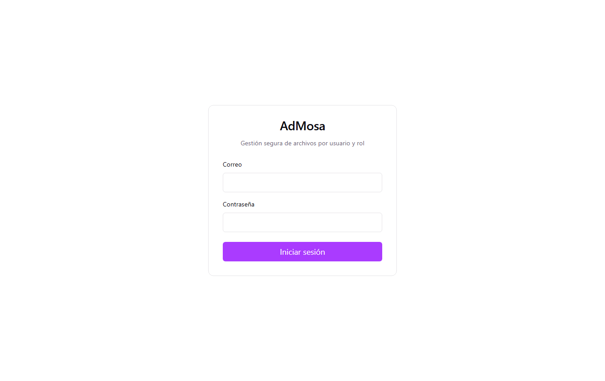

Usuarios de prueba (contraseña `Password123!` para todos):

| Correo | Rol | Área |
|---|---|---|
| admin@admosa.com | Administrador | — |
| gerente@admosa.com | Gerente | gestiona Ventas y Tecnología |
| jefe@admosa.com | Jefe de área | Ventas |
| usuario@admosa.com | Usuario estándar | Ventas |
| usuario2@admosa.com | Usuario estándar | Tecnología |

## 3. Cargar un archivo

En la pestaña **Archivos**, el botón **Subir archivo** permite elegir un archivo del equipo. Debajo del título se indican los formatos y el tamaño máximo permitidos.

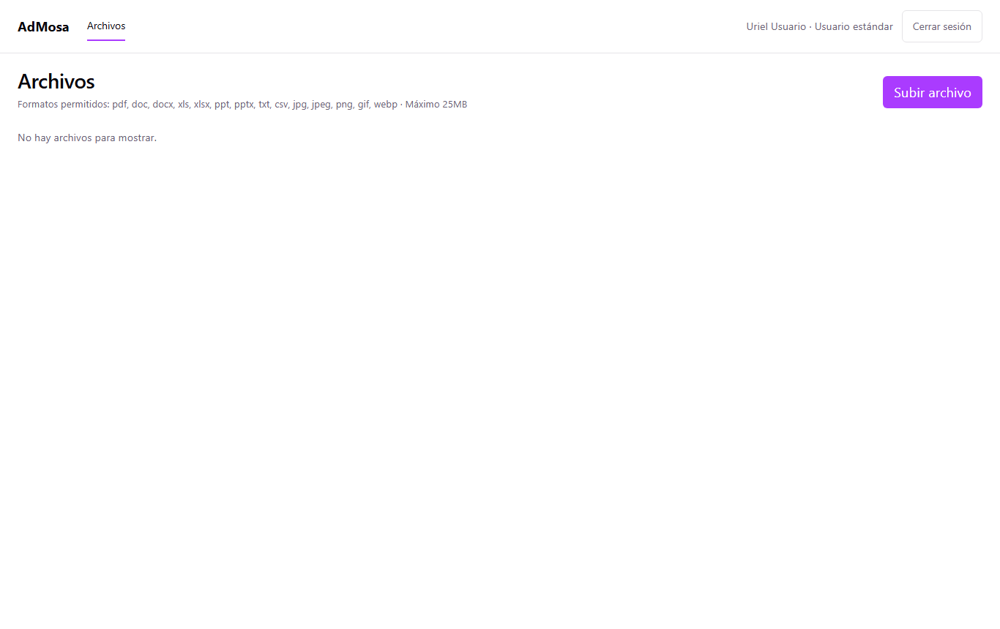

Si el archivo no cumple con el tipo o el tamaño permitido, la aplicación lo rechaza **antes de subirlo** y explica por qué:

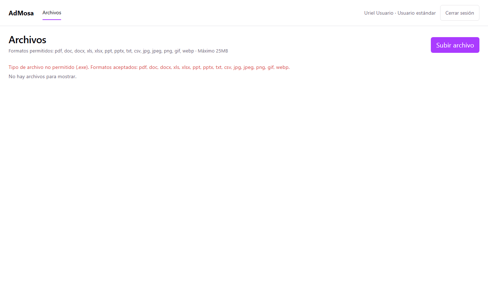

Cuando la carga es exitosa, aparece un mensaje de confirmación y el archivo se agrega a la tabla:

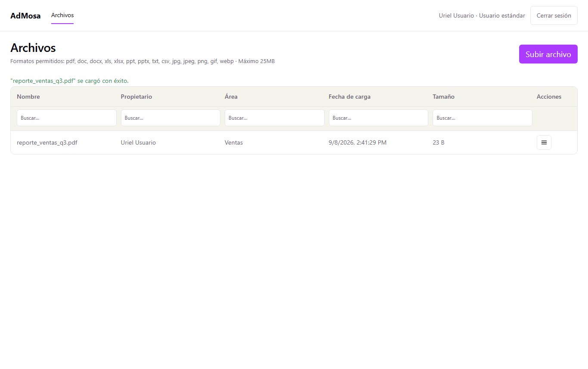

## 4. Ver, descargar o eliminar un archivo

El icono de la columna **Acciones** abre un menú con las opciones disponibles según tu rol y tu relación con ese archivo:

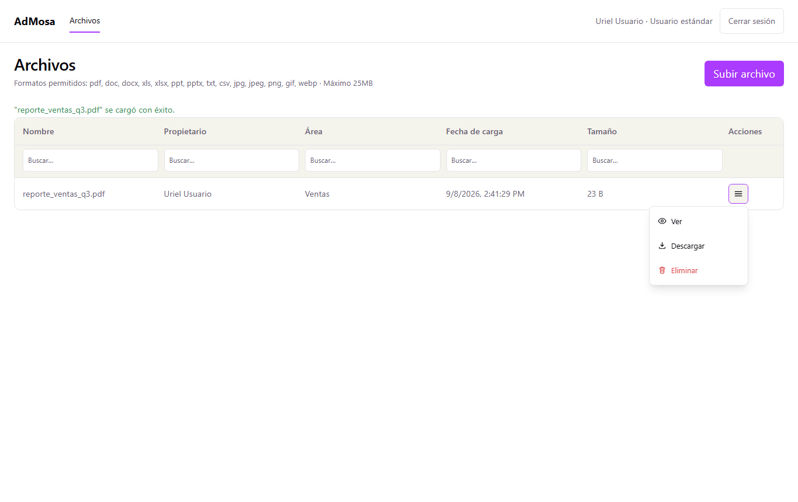

- **Ver**: abre una vista previa del archivo en una pestaña nueva, sin descargarlo.
- **Descargar**: descarga el archivo al equipo.
- **Eliminar**: pide confirmación y, si se acepta, borra el archivo de forma permanente.

Al eliminar un archivo se muestra un mensaje de confirmación:

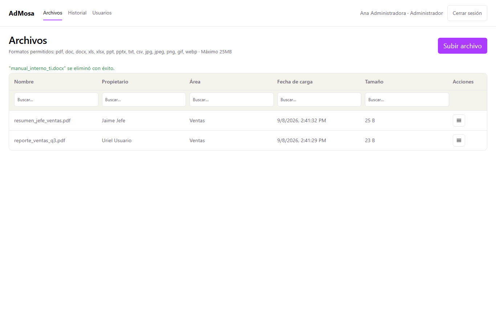

## 5. Buscar y filtrar

Cada tabla (Archivos, Historial, Usuarios) tiene un campo de búsqueda debajo de cada encabezado de columna. Escribe en cualquiera de ellos para filtrar los registros que coincidan; los filtros se pueden combinar entre columnas.

## 6. Alcance por área — ejemplo

Un **Jefe de área** ve, además de los suyos, los archivos de los demás usuarios de su misma área:

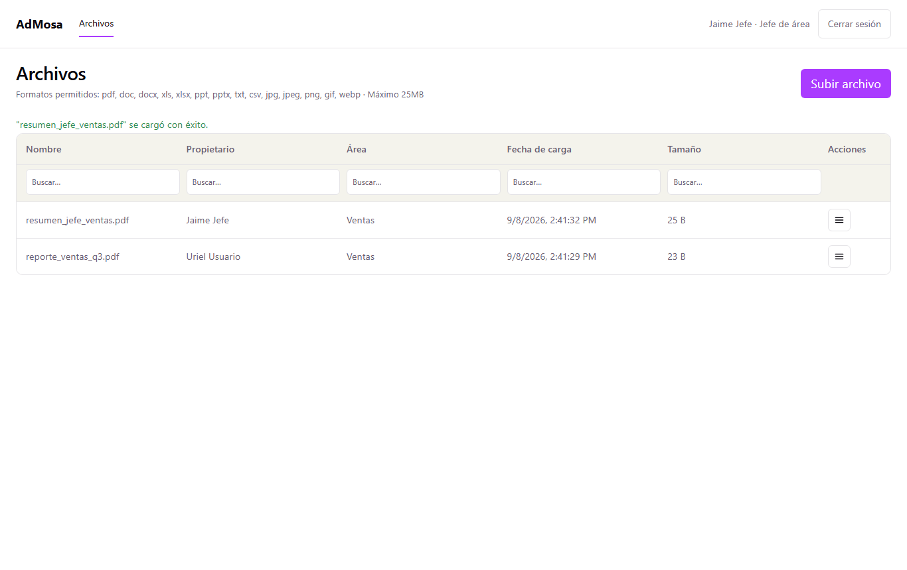

Un **Gerente** ve los archivos de todas las áreas que gestiona (en este ejemplo, Ventas y Tecnología):

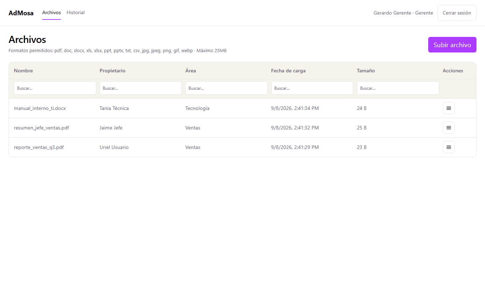

Un **Administrador** ve todos los archivos del sistema, sin importar el área o el propietario:

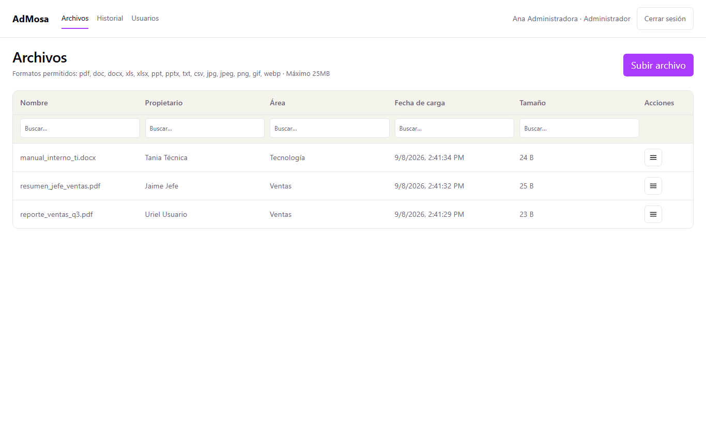

## 7. Historial de acciones

Disponible únicamente para **Gerente** y **Administrador** (no aparece en el menú para Usuario estándar ni Jefe de área). Registra cada carga, visualización, descarga y eliminación, con fecha, usuario y archivo involucrado.

Un Gerente ve las acciones de los usuarios de las áreas que gestiona:

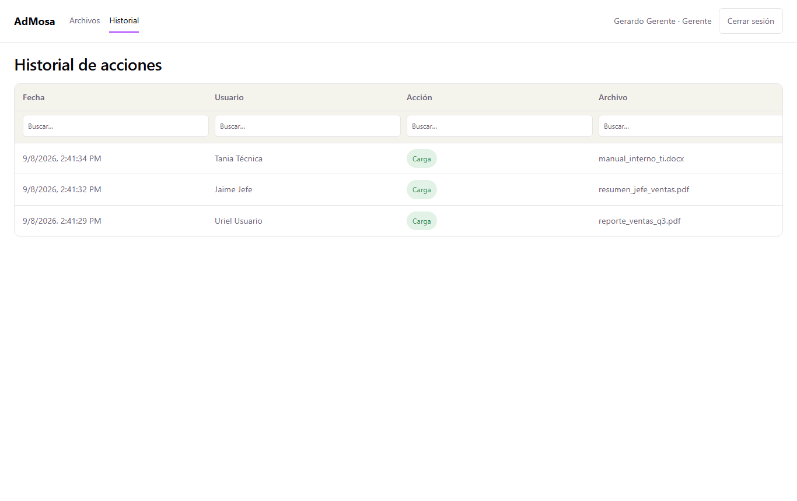

Un Administrador ve el historial completo del sistema:

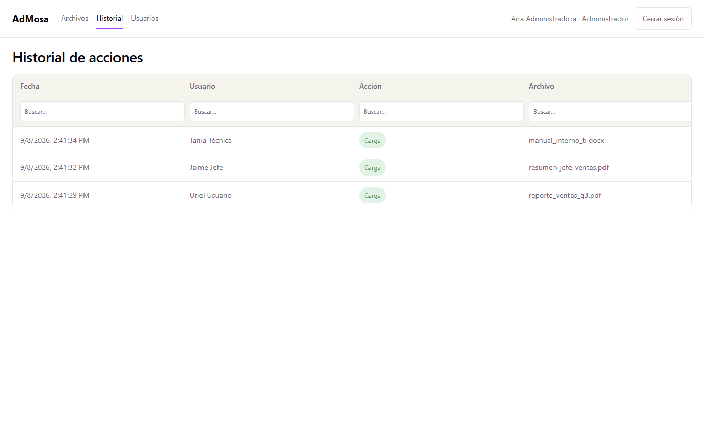

## 8. Administración de usuarios y áreas (solo Administrador)

Desde la pestaña **Usuarios**, el Administrador puede:

- Cambiar el **rol** de cualquier usuario.
- Asignar o cambiar el **área** de un Usuario estándar o Jefe de área.
- Marcar qué **áreas gestiona** un Gerente (columna "Áreas que gestiona"): un mismo Gerente puede gestionar varias áreas a la vez, y el cambio aplica de inmediato — si se le desmarca un área, deja de ver y administrar los archivos de esa área en el acto.

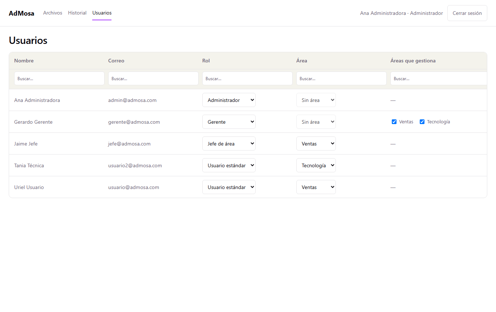

Notas sobre esta pantalla:
- El listado se muestra ordenado por jerarquía: Administrador, Gerente, Jefe de área y Usuario estándar.
- El combo de **Área** aparece bloqueado en "Sin área" para los roles Gerente y Administrador, porque ellos no pertenecen a un área propia — su relación con las áreas es a través de "Áreas que gestiona" (Gerente) o el acceso total (Administrador).
- La columna "Áreas que gestiona" solo aplica al rol Gerente; para los demás roles se muestra vacía.
